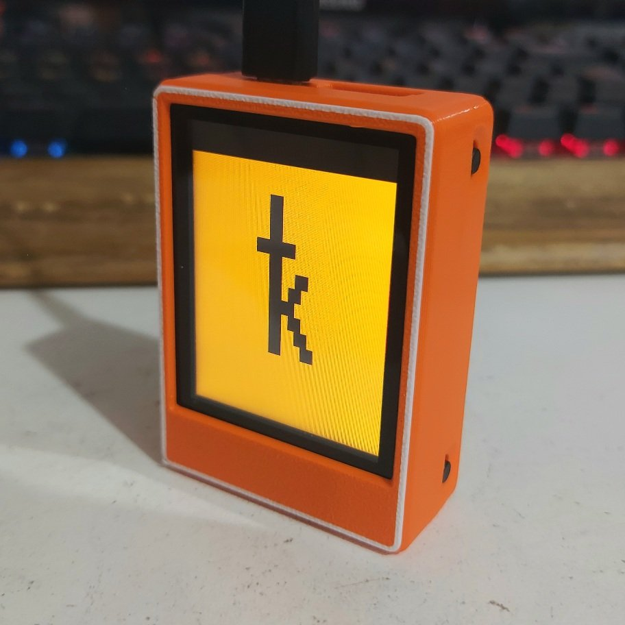

# Stackbit modcase for Yahboom
Modcase for Krux Yahboom.  
Backplate with front cover or only back cover.  
To make the change, simply remove the 4 screws, replace the back cover, and fit the front cover if applicable.

  
  
  

